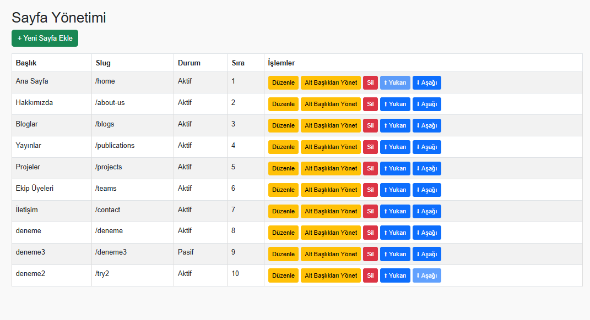
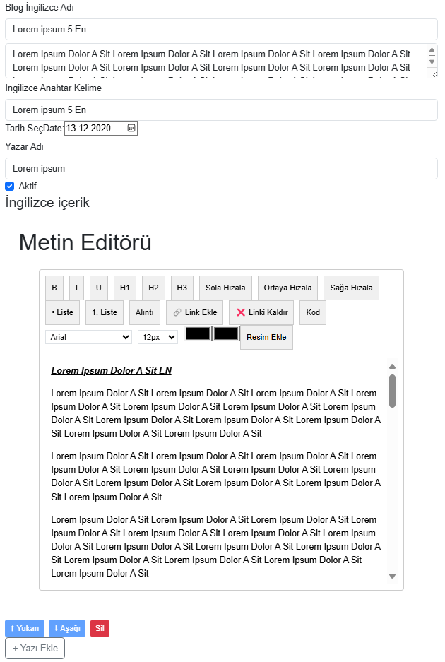

# 🌐 Blog Web Sitesi | Blog Website

## Live https://blog-website-react-js-express-js.onrender.com/

## 🇹🇷 Türkçe Açıklama

### 📌 Proje Hakkında
[Web Site Tanıtım Vieosu](./Blog-sitesi-tanıtım-videosu.mp4)
Bu proje, **React.js**, **Express.js** ve **PostgreSQL** kullanılarak geliştirilmiş tam işlevsel bir blog web sitesidir. Kullanıcılar, içerik oluşturabilir, kategorilere göre filtreleyebilir ve blog gönderilerini yönetebilir.

### 🧰 Kullanılan Teknolojiler

- React.js (Frontend)
- Express.js (Backend - RESTful API)
- PostgreSQL (Veritabanı)
- Node.js
- Sequelize (ORM)

### 📂 Proje Yapısı

```bash
📦 Blog-Website
 ┣ 📁 backend         # Sunucu tarafı - Express.js API
 ┣ 📁 frontend        # İstemci tarafı - React.js
 ┣ 📄 README.md
 ┣ 📄 kullanılacak teknolojiler.pdf
 ┗ 📄 how to start code.txt
```

### 📸 Görseller

#### Ana Sayfa Genel Ayarları


#### Sayfa Yönetimi


#### Sayfa İçerik Yönetimi


#### Alt Başlık Yönetimi


#### Blog Yönetimi


---

### ⚙️ Kurulum ve Başlatma

1. Depoyu klonlayın:
   ```bash
   git clone https://github.com/Ahmet-Sunaa/Blog-Website-React.js-Express.js-PostgreSQL.git
   ```
2. Postgre Databasede SQL Terminali açın:
   [database.txt](./database.txt) dosyasındaki kodlar ile veritabanını oluşturun.

3. Backend kurulumu:
   ```bash
   cd backend
   npm install
   npm start
   ```

4. Frontend kurulumu:
   ```bash
   cd ../frontend
   npm install
   npm start
   ```

> Detaylar için `how to start code.txt` dosyasına bakabilirsiniz.

---

### 🤝 Katkıda Bulunmak

Katkılarınızı memnuniyetle karşılıyoruz. Fork'layın, geliştirin ve pull request gönderin. Her katkı değerlidir!

---

### 📄 Lisans

Bu proje [MIT Lisansı](LICENSE) ile lisanslanmıştır.

---

## 🇬🇧 English Description

### 📌 About the Project

This is a full-featured blog website built with **React.js**, **Express.js**, and **PostgreSQL**. Users can create posts, filter by categories, and manage content easily.

### 🧰 Technologies Used

- React.js (Frontend)
- Express.js (Backend - RESTful API)
- PostgreSQL (Database)
- Node.js
- Sequelize (ORM)

### 📂 Project Structure

```bash
📦 Blog-Website
 ┣ 📁 backend         # Server side - Express.js API
 ┣ 📁 frontend        # Client side - React.js
 ┣ 📄 README.md
 ┣ 📄 kullanılacak teknolojiler.pdf
 ┗ 📄 how to start code.txt
```

### 📸 Screenshots


#### Ana Sayfa Genel Ayarları


#### Sayfa Yönetimi


#### Sayfa İçerik Yönetimi


#### Alt Başlık Yönetimi


#### Blog Yönetimi


---

### ⚙️ Setup & Run

1. Clone the repository:
   ```bash
   git clone https://github.com/Ahmet-Sunaa/Blog-Website-React.js-Express.js-PostgreSQL.git
   ```

2. Open the SQL Terminal in PostgreSQL:
   Use the code in the file [database.txt](./database.txt) to create the database.

3. Install backend dependencies:
   ```bash
   cd backend
   npm install
   npm start
   ```

4. Install frontend dependencies:
   ```bash
   cd ../frontend
   npm install
   npm start
   ```

> For more details, check the `how to start code.txt` file.

---

### 🤝 Contributing

We welcome all contributions! Fork the project, improve it, and send a pull request. Every bit helps.

---

### 📄 License

This project is licensed under the [MIT License](LICENSE).

---
